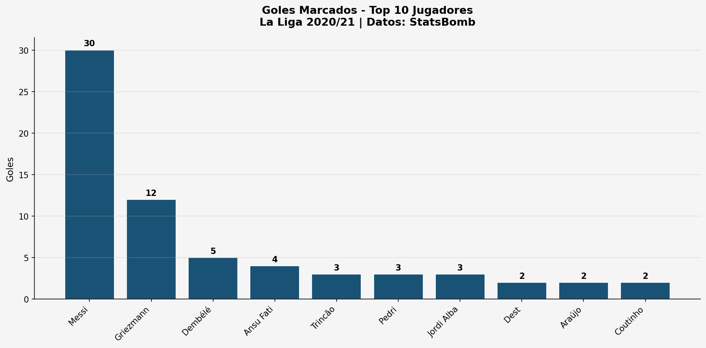
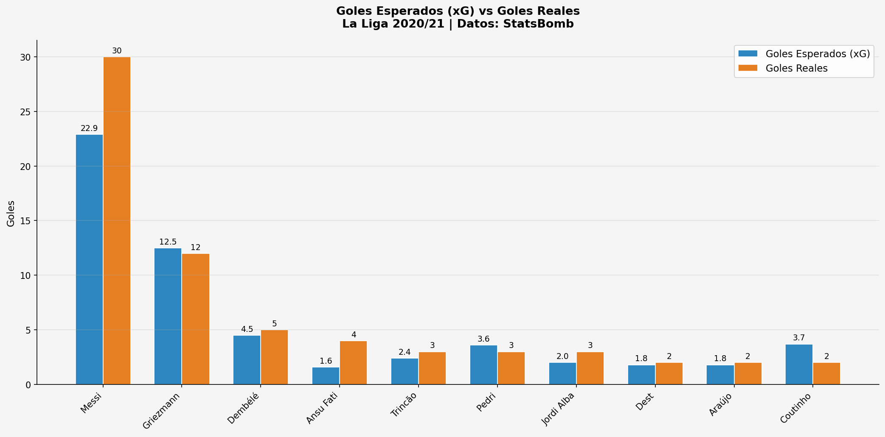
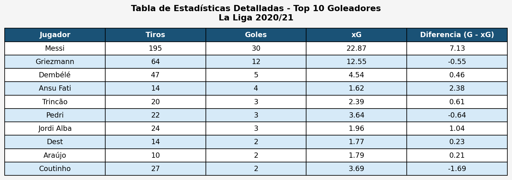

# Análisis de Rendimiento Goleador - La Liga 2020/21

## Descripción
Análisis exploratorio del rendimiento goleador de los top 10 jugadores de La Liga 2020/21,
comparando los goles reales anotados contra los goles esperados (xG) según los datos abiertos de StatsBomb.

## Visualizaciones
### Goles Marcados - Top 10 Jugadores


### Goles Esperados (xG) vs Goles Reales


### Tabla de Estadísticas Detalladas


## Hallazgos Principales
- **Messi** lideró ampliamente con 30 goles, superando su xG de 22.87 en +7.13 goles
- **Griezmann** fue el segundo máximo anotador con 12 goles
- Varios jugadores superaron su xG, lo que indica alta eficiencia en la finalización

## Tecnologías Utilizadas
- Python 3
- Pandas
- Matplotlib
- Seaborn
- StatsBombPy

## Datos
Datos abiertos y gratuitos de [StatsBomb Open Data](https://github.com/statsbomb/open-data).
Muestra de 35 partidos de La Liga 2020/21.

## Cómo reproducir el análisis
1. Instalar las dependencias:
```

pip install pandas matplotlib seaborn statsbombpy

```
2. Ejecutar el script:
```

python analisis_delanteros_laliga2425.py

```

## Autor
Tu Nombre  
[LinkedIn](https://www.linkedin.com/in/manuel-murillo91)  
[GitHub](https://github.com/admur91-analytics)
